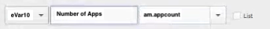

# 將Mobile Services處理規則移轉至Adobe Analytics

本檔案提供如何將您在Mobile Services UI中建立的任何其他處理規則（生命週期量度以外）移轉至Adobe Analytics的指示。

處理規則用於將上下文資料變數的值移至 prop 和 eVar。例如，您可以將「搜尋詞」上下文資料變數的值放入「商務變數」eVar的值中，並覆寫每次點擊的值。 若沒有處理規則，上下文資料變數就毫無意義，且不會填入 Analytics 的任何報表。

本檔案也會示範如何在Analysis Workspace中建立行動使用報告。

## 移轉處理規則

如果您運用Mobile Services來提供免費功能，例如處理規則和使用狀況報告功能，則可順暢地移至Analytics UI（處理規則UI或分析工作區）以完成這些功能。 對於「生命週期量度」或在AA處理規則UI中設定的規則，您不必進行任何移轉。 生命週期量度是「現成可用」的量度，在您的應用程式中首次實作Mobile SDK時會自動收集。

不過，如果您在Mobile Services UI中設定任何其他處理規則（生命週期量度以外），您應移轉這些規則，以便在失去Mobile Services存取權後，在Analytics中編輯／刪除它們。

1. Log in to `experience.adobe.com` and go to Mobile Services.
1. 按一下您要移轉至Adobe Analytics之行動應用程式的齒輪圖示，其上下文變數對應。
1. 按一下「 **[!UICONTROL 管理變數和量度]** 」功能表項目，然後按一下「 **[!UICONTROL 自訂變數]** 」標籤。 您可在此處查看哪些上下文變數映射（上下文資料）已新增至設定。 記下這些設定（或擷取螢幕擷取）。 範例：

   

1. 在Experience Cloud中，請切換至Adobe Analytics，並確定您所在的行動報表套裝與您在Mobile Services中所檢視的報表套裝相同。
1. 前往「管 **[!UICONTROL 理員]** >報表套裝 **[!UICONTROL >編輯設]** 定 **[!UICONTROL >一般]** > ********&#x200B;處理規則」。
1. 按一下&#x200B;**[!UICONTROL 新增規則]**.
1. 忽略條件並繼續新增Mobile Services中存在的相同上下文變數。

   

1. 按一下&#x200B;**[!UICONTROL 「儲存」]**。

## 分析工作區中的行動使用狀況報告

除了行動量度和維度（如果報表套裝已啟用Mobile Services）之外，分析工作區還包含數個可協助分析的行動專案範本：

* **[!UICONTROL 訊息]**:著重於應用程式內和推播訊息效能。
* **[!UICONTROL 位置]**:包含展示位置資料的地圖。
* **[!UICONTROL 關鍵量度]**:掌握應用程式的關鍵量度。
* **[!UICONTROL 應用程式使用]**:應用程式有多少個應用程式使用者、啟動和首次啟動，平均作業長度為何？
* **[!UICONTROL 贏取]**:行動贏取連結的效能如何？
* **[!UICONTROL 效能]**:應用程式的效能如何，使用者在哪裡有問題？
* **[!UICONTROL 保留]**:我的忠誠使用者有哪些？
* **[!UICONTROL 旅程]**:我的應用程式有哪些顯著的使用模式？

以下是「行動應用程式使用」範本的摘錄：

若要存取範本：

1. Log in to `experience.adobe.com` and select Analytics.
1. 請確定您位於已啟用Mobile Services的報表套裝中。
1. Click the **[!UICONTROL Workspace]** tab.
1. 按一下&#x200B;**[!UICONTROL 「建立新專案」]**。
1. 選取任何行動範本，然後按一下「 **[!UICONTROL 建立]**」。

## 移轉其他Mobile Services功能

下列Mobile Services功能也與Adobe Analytics有關聯，但需要購買的Adobe Analytics SKU:

* 「贏取連結」
* 推送訊息
* 應用程式內傳訊
* 地點目標管理

如果您要運用Mobile Services來提供付費功能，則沒有可行的移轉路徑，無法移轉至其他內部／外部工具：

* 若是贏取連結，我們可以將您導向Adobe合作夥伴，以滿足您的需求。
* 推播訊息和應用程式內訊息可在Adobe Campaign Standard和Adobe Campaign Classic中使用（僅限推送）。 不過，用於定位的基礎資料集不同。 我們建議與您的Adobe客戶團隊合作，以決定傳訊資料的移轉選項。
* 針對位置功能，建議您採用全新 [Adobe Experience Platform Location Service](https://www.adobe.com/experience-platform/location-service.html)，此服務對所有AEP客戶都是免費的。
